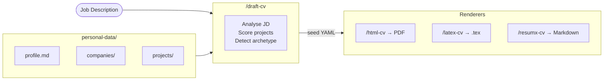

# CV Builder

An AI-powered system for maintaining a structured dataset of your work experience and generating tailored, ATS-compliant CVs from it — one command at a time.

## How it works

Instead of maintaining multiple CV versions, you keep a single dataset of your projects and experience. When you apply for a role, you paste the JD and the system generates a tailored CV — selecting the most relevant projects, detecting the hiring archetype, rewriting the summary to match, and mirroring the JD's keywords.

**Three-layer pipeline:**



- `personal-data/` — raw facts about your career. Format-agnostic. Never tailored to any specific job.
- `/draft-cv` — analyses the JD, scores projects, detects archetype, and produces a seed YAML with actual CV prose.
- Renderers (`/resumx-cv`, `/latex-cv`, `/html-cv`) — take the seed and apply format-specific layout. Zero content decisions.

## Setup

**Requirements:** Any AI agent listed on [agentskills.io/clients](https://agentskills.io/clients).

1. Clone this repo
2. Run `/personal-log` to set up your profile and add your employers and projects (or say "I have an old CV" to import in bulk)
3. Run `/setup-archetypes` to define your target role profiles (required for archetype-aware tailoring)

> **Sample data:** Check out the [`examples`](../../tree/examples) branch to see populated company and project files you can use as reference or test with.
> **Privacy:** If you push your personal data, keep your fork private.

## Agent compatibility

Skills follow the [Agent Skills open standard](https://agentskills.io/specification) and work out of the box after cloning — no extra setup needed.

| Agent | Reads from |
|-------|-----------|
| Claude Code | `.claude/skills/` |
| Cursor | `.agents/skills/` |
| Gemini CLI | `.agents/skills/` |
| GitHub Copilot | `.agents/skills/` |
| OpenAI Codex | `.agents/skills/` |
| Junie, OpenHands, Goose, Roo Code, Amp, and others | `.agents/skills/` |

## Commands

| Command | What it does |
|---------|-------------|
| `/personal-log` | Add or update career data — projects, companies, certifications, skills, etc. |
| `/setup-archetypes` | Define your target role archetypes in `agents-ref/archetypes.yaml`. Run once; re-run when target roles change. |
| `/draft-cv [JD]` | Analyse a JD, score projects, detect archetype, produce `analysis.md` + `draft-cv.yaml` |
| `/resumx-cv [seed]` | Render seed to ResumeX-compatible Markdown — paste into the browser playground for PDF |
| `/latex-cv [seed]` | Render seed to a compilable LaTeX `.tex` file (Harvard style) — compile via Overleaf |
| `/html-cv [seed]` | Render seed to browser-previewable HTML — preview in browser; export PDF via browser print or `./html-to-pdf` for clickable links |
| `/draft-letter` | Draft a tailored cover letter from a prior `/draft-cv` run — produces `draft-letter.yaml` |
| `/html-letter [seed]` | Render `draft-letter.yaml` into a browser-previewable HTML cover letter |

## Data architecture

The system has three layers with strict responsibility boundaries:

**`personal-data/`** — raw facts, format-agnostic. `profile.md` stores personal info, skills, education. Each employer gets a file in `companies/`, each project in `projects/`. Nothing here is tailored to any specific job.

**`draft-cv`** — makes all content decisions: which projects to include, which bullets to write, how to frame the summary, how to order skills. Produces a seed YAML with actual prose.

**Renderers** — make zero content decisions. They take the seed and apply format-specific styling: link format, date positioning, column layout, PDF output.

> Rule: if a decision affects what the reader learns, it belongs in `draft-cv`. If it only affects how it looks, it belongs in the renderer.

## Output structure

Each application lives in `jobs/[company-role]/`. Each `/draft-cv` run creates a timestamped subfolder:

```
jobs/tnt_lab-frontend_engineer/
  2026-04-07_14-30_jd.md          ← save the JD here manually
  2026-04-07_14-30/                ← run folder (one per /draft-cv run)
    analysis.md                    ← decision log
    draft-cv.yaml                  ← seed
    resumx-cv/cv.md                ← added by /resumx-cv
    latex-cv/cv.tex                ← added by /latex-cv
    html-cv/cv(harvard).html       ← added by /html-cv
```

## Going deeper

- **[Quickstart](docs/quickstart.md)** — zero to PDF in ~5 minutes
- **[Guide](docs/guide.md)** — full workflow reference: scenarios, renderers, command frequency
- **[Schema reference](agents-ref/schema.md)** — enums, tag taxonomy, stack naming conventions, section rules for project files
- **[Glossary](docs/glossary.md)** — definitions for archetype, seed, proof points, run folder, match tier, keyword coverage
- **[FAQ](docs/faq.md)** — common issues: project not selected, archetype detection skipped, low keyword coverage, date mismatches

## License

[AGPL 3.0](LICENSE) — free to use, fork, and contribute; if you deploy this as a service, you must open-source your modifications. Commercial use requires a separate license — see [COMMERCIAL.md](COMMERCIAL.md).
