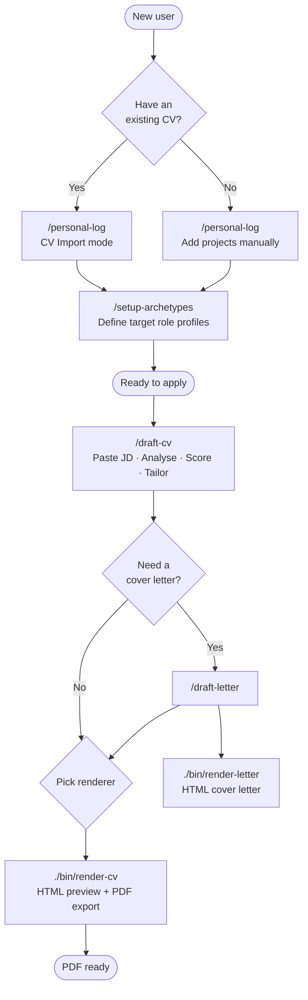

# Guide

> New here? Start with the [Quickstart](quickstart.md) to get your first PDF in ~5 minutes.

A full reference guide to using CV Builder — commands, scenarios, and renderer options.

> **Agent compatibility:** this guide applies to Claude Code, Cursor, Gemini CLI, and all other agents listed on [agentskills.io/clients](https://agentskills.io/clients). Skills are loaded automatically from `.agents/skills/` — no extra setup needed.

---

## How the commands fit together

> **One-time:** `/setup-archetypes` — re-run only when your target role type changes.
> **Occasional:** `/personal-log` — after finishing a project or changing jobs.
> **Every application:** `/draft-cv` + a renderer.

---

## Common scenarios

### "I'm new and I already have a CV somewhere"

The fastest path in. Instead of entering your experience item by item, import it all at once.

1. Run `/personal-log` and say "I have an old CV I'd like to import" — paste your CV text or give the file path
2. The skill extracts companies, projects, and profile info, walks you through each item, and writes the files
3. Run `/setup-archetypes` to define what kind of roles you're targeting
4. You're ready — paste a JD and run `/draft-cv`

---

### "I'm actively applying and have a JD in front of me right now"

The core loop you'll run for every application.

1. Run `/draft-cv` and paste the JD (or the file path)
2. Review `analysis.md` — check which projects were selected and why, and whether any gaps were flagged
3. If the match tier is LOW and the gaps are real, consider whether this role is worth pursuing
4. Render the seed: `./bin/render-cv <run-folder>/draft-cv.yaml --theme harvard` (or `--theme modern`). Open the resulting HTML in a browser to preview, then either `File > Print` or `./html-to-pdf <file>` for a PDF with clickable links
5. If the role needs a cover letter: run `/draft-letter`, then `./bin/render-letter <run-folder>/draft-letter/draft-letter.yaml --theme modern`

---

### "I just wrapped a project and want to capture it before I forget"

Log it now while the details are fresh. Even rough notes are better than nothing — the skill will ask follow-up questions.

1. Run `/personal-log` and describe what you worked on
2. The skill asks for dates, stack, and at least one concrete outcome — if your achievement is vague ("improved performance"), it pushes for specifics
3. Once saved, the project becomes part of your dataset and will be considered in every future `/draft-cv` run

Good rule of thumb: log a project within a week of finishing it. Numbers and context are much harder to recall later.

---

### "I want to start applying for a different type of role"

If you've been targeting frontend product roles and now want to pivot to AI/ML or backend, your archetypes need to reflect that.

1. Run `/setup-archetypes` — it scans your existing projects and suggests role profiles that match your actual dataset
2. Review the suggested archetypes and add signals that match the new role type's JD language
3. Re-run `/draft-cv` on a JD from the new role family — the summary and bullet framing will shift accordingly

You don't need to change any project files — only the archetype definitions change.

---

## One-time setup

Run these once when you first clone the repo. You won't need them again unless your target roles change.

| Step | Command | What it does |
|------|---------|--------------|
| 1 | `/personal-log` | Set up your profile and add employers + projects — or say "I have an old CV" to import in bulk |
| 2 | `/setup-archetypes` | Define your target role profiles — required for archetype-aware tailoring |
| 3 | `cd bin && npm install` | Install `handlebars`, `js-yaml`, and `puppeteer`. Required by `./bin/render-cv`, `./bin/render-letter`, and the optional `./html-to-pdf` step. |

---

## Every time you apply for a job

| Step | Command | What it does |
|------|---------|--------------|
| 1 | `/draft-cv [JD]` | Paste the JD — analyses it, scores projects, produces `analysis.md` + `draft-cv.yaml` |
| 2 | `/draft-letter` *(optional)* | Drafts a cover letter from the same analysis |
| 3 | Run the renderer | `./bin/render-cv <path/to/draft-cv.yaml> --theme <harvard\|modern>` — see below |

---

## Choosing a renderer

Both renderers are deterministic Node CLIs — no AI involvement. Output is byte-identical for the same input + theme.

| Command | Best for | Requirement |
|---------|----------|-------------|
| `./bin/render-cv <path/to/draft-cv.yaml> --theme <harvard\|modern>` | Browser preview + PDF export. `./html-to-pdf` produces PDF with clickable links | `cd bin && npm install` once |
| `./bin/render-letter <path/to/draft-letter.yaml> --theme modern` | Cover letter HTML preview + PDF export (use after `/draft-letter`) | `cd bin && npm install` once |

---

## Command frequency at a glance

**Every application:**
- `/draft-cv` — always; paste the JD directly
- `./bin/render-cv <path/to/draft-cv.yaml> --theme <harvard|modern>` — render the seed to HTML for browser preview and PDF export

**Occasionally:**
- `/personal-log` — after finishing a project, changing jobs, or earning a certification

**Once (or rarely):**
- `/setup-archetypes` — re-run only when your target role family changes

---

## Troubleshooting

See [faq.md](faq.md) for common issues: project not selected, archetype detection skipped, low keyword coverage, wrong dates.
